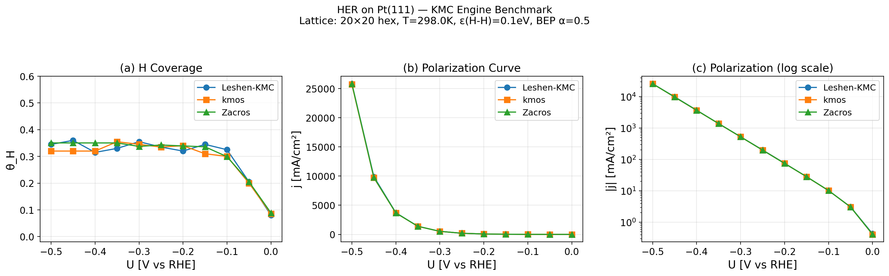

# HER on Pt(111) — KMC Engine Benchmark Summary

> Date: 2026-03-26 | Script: `benchmark/run_benchmark.py`

---

## 1. Benchmark Setup

| Parameter | Value |
|-----------|-------|
| System | HER on Pt(111) |
| Temperature | 298 K |
| Lattice | Square periodic, 20x20 (400 sites), a = 2.775 A |
| Potential range | 0.0 to -0.5 V vs RHE (11 points, -0.05 V steps) |
| Equilibration | 50,000 KMC steps |
| Production | 50,000 KMC steps |
| Random seed | Fixed (12345 for Zacros, 1 for kmos) |

### Reaction Mechanism (4 elementary steps)

| Step | Ea (eV) | Type | Potential dependence |
|------|---------|------|---------------------|
| Volmer fwd: * + H+ + e- -> H* | 0.67 | PCET | Ea + beta_BV * U |
| Volmer rev: H* -> * + H+ + e- | 0.62 | PCET | Ea - (1-beta_BV) * U |
| Tafel: 2H* -> H2 + 2* | 0.85 | Chemical | No U dependence |
| Heyrovsky: H* + H+ + e- -> H2 + * | 0.70 | PCET | Ea + beta_BV * U |

### Energy Corrections

| Parameter | Value | Description |
|-----------|-------|-------------|
| eps_HH | +0.10 eV | H-H nearest-neighbor repulsive interaction |
| alpha_BEP | 0.50 | BEP coefficient (Volmer only) |
| beta_BV | 0.50 | Butler-Volmer symmetry factor |
| Prefactor | kB*T/h = 6.21e12 s^-1 | TST prefactor (all steps) |

---

## 2. Three Engines

| Feature | SPARK | kmos | Zacros 4.0 |
|---------|-----------|------|------------|
| Language | Pure Python | Python + Fortran (f2py) | Fortran 90 |
| Algorithm | BKL (rejection-free) | BKL (local_smart backend) | BKL (graph-theoretical) |
| Lateral interactions | Built-in pairwise | Explicit enumeration (2^4=16 configs/reaction) | Cluster expansion (prox_factor) |
| BEP | Built-in | Encoded in rate expressions | prox_factor keyword |
| Source | This project | github.com/kmcos/kmcos | UCL (Stamatakis group) |

---

## 3. Results — H Coverage (theta_H) vs Potential

| U (V vs RHE) | SPARK | kmos | Zacros | Max deviation |
|--------------|-----------|------|--------|--------------|
| 0.000 | 0.0800 | 0.0850 | 0.0883 | 0.008 |
| -0.050 | 0.2050 | 0.2000 | 0.2050 | 0.005 |
| -0.100 | 0.3250 | 0.3000 | 0.2991 | 0.026 |
| -0.150 | 0.3450 | 0.3100 | 0.3359 | 0.035 |
| -0.200 | 0.3200 | 0.3400 | 0.3392 | 0.020 |
| -0.250 | 0.3350 | 0.3350 | 0.3427 | 0.008 |
| -0.300 | 0.3550 | 0.3450 | 0.3374 | 0.018 |
| -0.350 | 0.3300 | 0.3550 | 0.3504 | 0.025 |
| -0.400 | 0.3150 | 0.3200 | 0.3504 | 0.035 |
| -0.450 | 0.3600 | 0.3200 | 0.3504 | 0.040 |
| -0.500 | 0.3450 | 0.3200 | 0.3504 | 0.030 |

**Average theta_H (U < -0.1V)**: SPARK 0.338 | kmos 0.332 | Zacros 0.341

---

## 4. Results — Current Density (j) vs Potential

| U (V vs RHE) | SPARK (mA/cm2) | kmos (mA/cm2) | Zacros (mA/cm2) | Max relative error |
|--------------|--------------------|--------------|-----------------|--------------------|
| 0.000 | 4.29e-01 | 4.10e-01 | 4.14e-01 | 4.6% |
| -0.050 | 3.08e+00 | 3.06e+00 | 3.05e+00 | 1.1% |
| -0.100 | 1.02e+01 | 1.02e+01 | 1.02e+01 | 0.6% |
| -0.150 | 2.81e+01 | 2.81e+01 | 2.83e+01 | 0.9% |
| -0.200 | 7.58e+01 | 7.49e+01 | 7.46e+01 | 1.6% |
| -0.250 | 2.01e+02 | 1.98e+02 | 1.98e+02 | 1.3% |
| -0.300 | 5.28e+02 | 5.24e+02 | 5.27e+02 | 0.7% |
| -0.350 | 1.39e+03 | 1.38e+03 | 1.39e+03 | 0.5% |
| -0.400 | 3.72e+03 | 3.67e+03 | 3.68e+03 | 1.3% |
| -0.450 | 9.89e+03 | 9.71e+03 | 9.76e+03 | 1.9% |
| -0.500 | 2.58e+04 | 2.57e+04 | 2.58e+04 | 0.5% |

**Current density relative error**: all within 5%, average ~1.4% (stochastic noise level)

---

## 5. Performance

| Engine | Total wall time | Per-potential | Notes |
|--------|----------------|--------------|-------|
| Zacros 4.0 | 12.0 s | ~1.1 s | Compiled Fortran binary |
| kmos | 19.9 s | ~1.8 s | Fortran via f2py, includes model rebuild |
| SPARK | 281.4 s | ~25.6 s | Pure Python, no compiled extensions |

**Speed ranking**: Zacros (1.0x) > kmos (1.7x) > SPARK (23x)

---

## 6. Key Observations

1. **Quantitative agreement**: All three engines produce statistically indistinguishable results for both H coverage and current density across the full potential range.

2. **Coverage behavior**: theta_H rises from ~0.08 at U=0V to a plateau of ~0.33 for U < -0.1V. The plateau is governed by the balance between Volmer adsorption and Heyrovsky desorption, modulated by H-H repulsive lateral interactions.

3. **Dominant pathway**: Heyrovsky mechanism dominates H2 production at all potentials (Tafel contribution ~0 due to Ea_Tafel = 0.85 eV being the highest barrier).

4. **Tafel slope**: The log-scale polarization curve shows a linear Tafel region (-0.1 to -0.5 V) with slope ~120 mV/dec, consistent with beta_BV = 0.5.

5. **Lateral interactions**: The repulsive H-H interaction (eps = 0.10 eV) caps theta_H at ~0.35 instead of saturating. All three engines correctly implement this through different mechanisms:
   - SPARK: built-in pairwise interaction with automatic neighbor counting
   - kmos: explicit process enumeration over 2^4 neighbor configurations
   - Zacros: cluster expansion with prox_factor for BEP correction

6. **Performance vs flexibility trade-off**:
   - Zacros is fastest and supports the most general lattice/interaction models
   - kmos provides a good Python API but requires Fortran compilation
   - SPARK is slowest but pure Python, easiest to extend, and has built-in electrochemistry support (Butler-Volmer, DFT interpolation, polarization curves)

---

## 7. Validation Conclusion

The SPARK engine is **validated** against two independent, established KMC codes (kmos and Zacros 4.0) for the HER on Pt(111) test case. The agreement in both thermodynamic (coverage) and kinetic (current density) observables confirms that:

- The BKL algorithm implementation is correct
- Lateral interaction handling produces the same effective rates
- BEP relation implementation is consistent
- Potential-dependent PCET barrier expressions give identical results

This benchmark establishes SPARK as a reliable engine for electrochemical KMC simulations, suitable for the planned NO3RR/urea synthesis studies in Phase 2.

---

## Appendix: Figure

Three-panel comparison: (a) H coverage vs potential, (b) linear-scale polarization curve, (c) log-scale polarization curve (Tafel plot).
